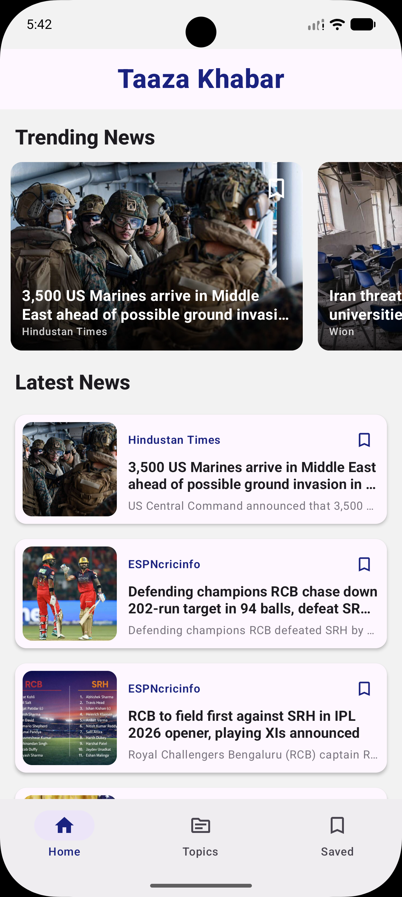
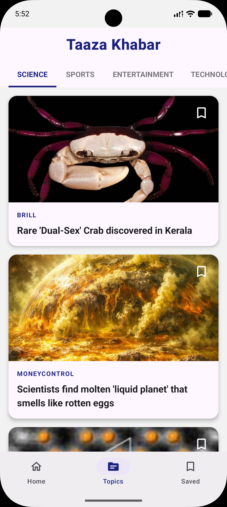
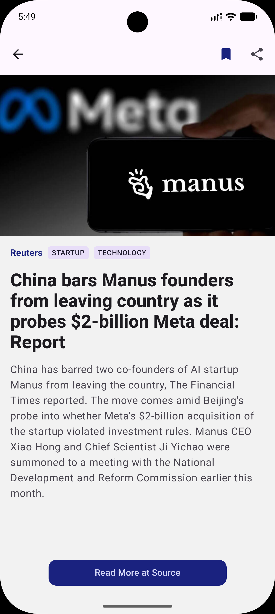
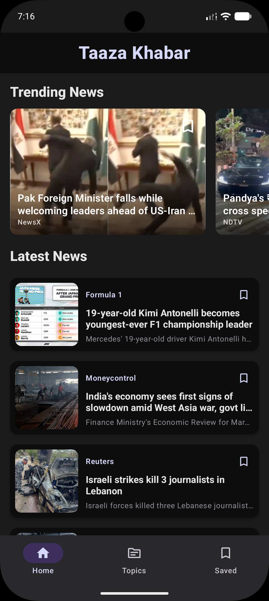
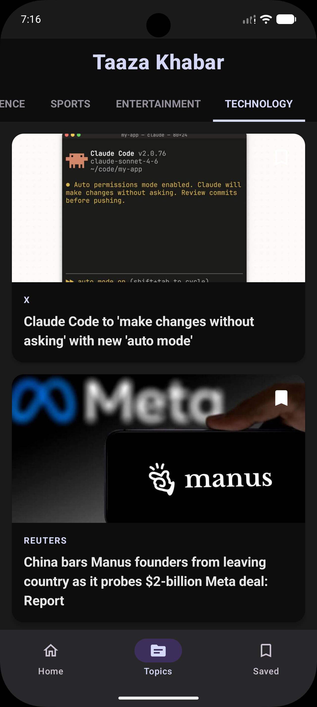
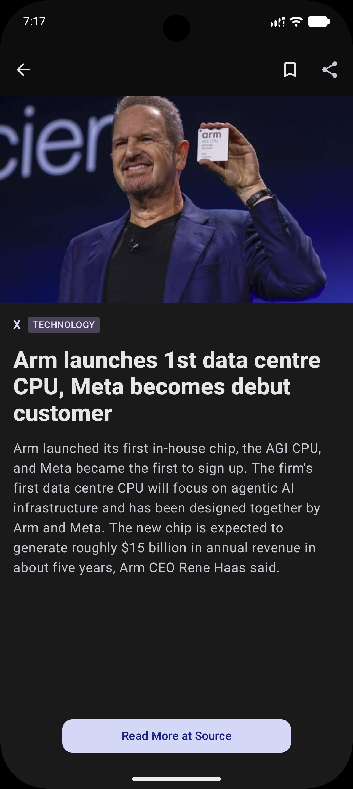

# 📰 Taaza Khabar

**Taaza Khabar** is a modern Android news application built using clean architecture principles.
It delivers real-time news using publicly accessible endpoints inspired by the Inshorts app, with a smooth user experience, offline support, and efficient data handling.

---

## 🚀 Features

* 📰 Topic-wise news browsing
* 💾 Custom local caching strategy using Room Database
* ⭐ Save news feature (bookmark articles for later)
* 🌗 Light & Dark theme support
* 🖼️ Efficient image loading using Coil
* ⚡ Smooth and responsive UI
* 🛠️ Robust error handling
* 🧠 Clean Architecture (MVVM)

---

## 🧱 Tech Stack

* **Kotlin**
* **MVVM + Clean Architecture**
* **Room Database**
* **Dagger Hilt (Dependency Injection)**
* **KSP (migrated from KAPT)**
* **Retrofit (API Integration)**
* **Coil (Image Loading)**

---

## 🏗️ Project Architecture

This project follows **Clean Architecture** with clear separation of concerns:

* **Presentation Layer** → UI + ViewModels
* **Domain Layer** → Business logic + UseCases
* **Data Layer** → API, Database, Repository implementations

---

## 📁 Project Structure

```
app/
├── data/
│   ├── local/
│   │   ├── dao
│   │   ├── entities
│   │   └── database
│   ├── paging/
│   │   └──NewsPagingSource
│   ├── remote/
│   │   ├── dto
│   │   └── api
│   └── repository/
│       └── NewsRepositoryImpl
│
├── di/
│   ├── DatabaseModule
│   ├── NetworkModule
│   └── RepositoryModule
├── domain/
│   ├── model/
│   ├── repository/
│   └── usecases/
│
├── presentation/
│   ├── components/
│   │   ├── AppBar
│   │   ├── NewsItems
│   │   └── NavigationBar
│   ├── screens/
│   │   ├── Detail
│   │   ├── Home
│   │   └── Topics
│   ├── ui.theme
│   ├── ViewModels
│   └── MainActivity
│
└── App for dependency injection
```

---

## 📸 Screenshots

| Home                      | Topics                     | Saved                      | Detail                      |
| ------------------------- | -------------------------- |----------------------------|-----------------------------|
|  |  |  |  |

Dark Theme: 

| Home                           | Topics                          | Saved                           | Detail                           |
|--------------------------------|---------------------------------|---------------------------------|----------------------------------|
|  |  |  |  |
---

## 🎨 UI & Design

* App logo designed using **Inkscape**
* Logo animation created using **shapeshifter.design**
* Splash screen implemented for better user experience

---

## ⚠️ Challenges & Solutions

### ❌ Challenge

* Integrating official pagination (`RemoteMediator`) required a more complex setup and deeper understanding of paging behavior

### ✅ Solution

* Implemented a custom batch-based caching mechanism
* Stored articles in chunks (10 per load)
* Used multiple caching tables to simulate pagination
* Ensed smooth scrolling and offline access

---

## 🔥 Highlights

* Implemented **custom pagination-like caching**
* Migrated from **KAPT to KSP** mid-project to improve build performance
* Focused on **scalability and maintainability** using clean architecture

---

## 🧠 What I Learned

* Implementing clean architecture in a real-world project
* Handling complex data flows and caching strategies
* Managing local + remote data efficiently
* Improving build performance using KSP
* Structuring scalable Android applications

---

## 🛠️ Setup Instructions

1. Clone the repository:

   ```bash
   git clone https://github.com/Ankit6321/taaza-khabar.git
   ```

2. Open in Android Studio

3. Sync Gradle and run the app

---

## ⚠️ Disclaimer

This project is developed for **educational purposes only**.
The news data is fetched from publicly accessible endpoints associated with the Inshorts app.
This project is **not affiliated with or endorsed by Inshorts**.

---

## 📌 Future Improvements

* Implement official pagination using `RemoteMediator`
* Add search functionality
* Improve UI animations and transitions

---

## 📄 License

This project is open-source and available under the MIT License.
